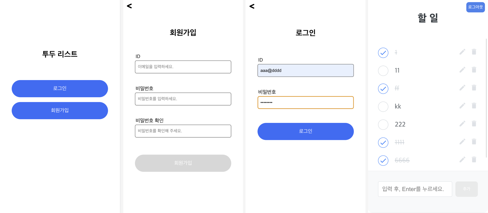

# 원티드 프리온보딩 프론트엔드 인턴십

원티드 프리온보딩 프론트엔드 인턴십 선발과제입니다.  
[👉선발과제 링크](https://github.com/walking-sunset/selection-task)

<br><br>

## 배포 링크

[🎯프로젝트 배포 링크](https://astounding-starship-d27d83.netlify.app)




<br><br>

## 프로젝트 실행 방법

### 설치 및 실행

```md
git clone https://github.com/ShinjungOh/wanted-pre-onboarding-frontend 

npm install
npm start
```

<br><br>

## 프로젝트 설명

### 1. 로그인 / 회원가입

* 유효성 검사
  * 회원가입, 로그인 시 `이메일에 @ 포함, 비밀번호 8자 이상` 조건을 만족하는지 검사합니다.
  * 유효성 검사에 통과하면 로그인/회원가입 버튼이 활성화 됩니다.
  * 비밀번호 확인의 경우, 비밀번호와 동일한 값을 입력했는지 체크합니다.
  * 로그인/회원가입에 각각 성공하거나 실패한 경우, alert 창으로 결과를 알려줍니다.
* API 호출
  * 로그인에 성공할 경우, todo 페이지로 이동합니다.
  * 로그인/회원가입시 로컬 스토리지에 토큰이 저장됩니다.
* 리다이렉트 처리
  * 토큰이 존재할 경우, todo 페이지로 이동합니다.
  * 토큰이 존재하지 않는 경우, 메인 페이지로 이동합니다. 
  * 로그아웃 버튼을 누르면 로컬 스토리지의 토큰이 삭제되고 메인 페이지로 이동합니다.

<br>

### 2. 투두 리스트

* 목록 조회, 추가
  * todo 페이지에서 투두 리스트의 목록을 볼 수 있습니다.
  * 할 일 왼쪽의 체크 박스에 완료 여부가 표시됩니다.
  * 하단의 입력창과 추가 버튼에서 새로운 할 일을 등록할 수 있습니다. 
  * 1글자 이상 입력해야 추가 버튼이 활성화 됩니다.
* 수정, 삭제
  * 투두 리스트의 개별 아이템 우측 수정버튼을 누르면 수정모드가 활성화되고, 할 일 내용을 수정할 수 있습니다. 
  * 수정모드에서 개별 아이템의 우측에 제출버튼과 취소버튼이 표시됩니다.
  * 해당 버튼을 통해서 수정 내용을 제출하거나 수정을 취소할 수 있습니다. 
  * 할 일 우측의 삭제 버튼을 누르면 해당 할 일이 삭제됩니다.
